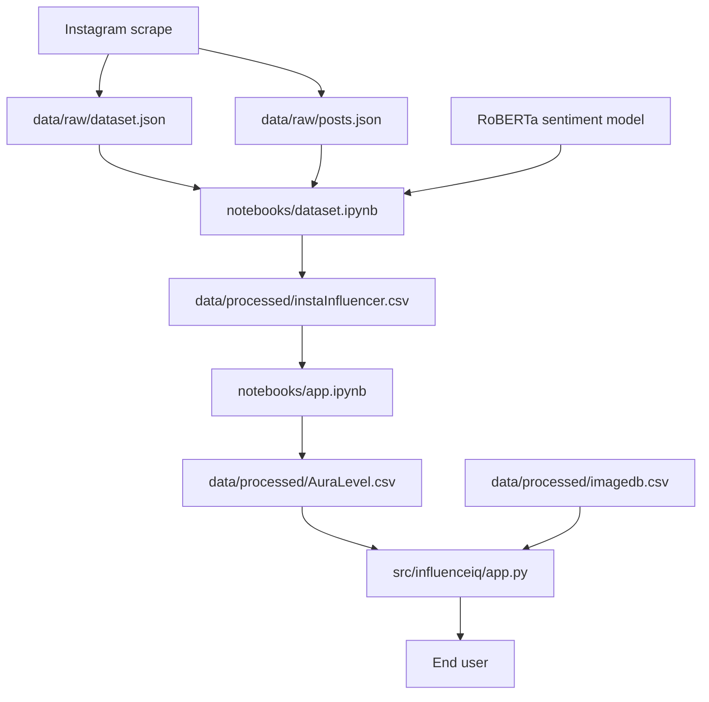
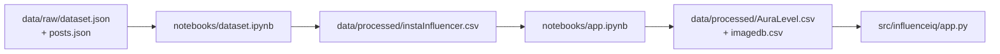
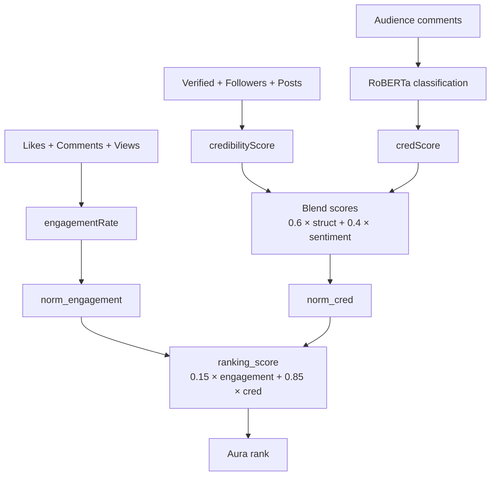

# InfluenceIQ — End-to-End Project Documentation

**InfluenceIQ** is an AI-powered Instagram influencer ranking system. It measures and ranks influencers based on **engagement**, **structural credibility** (followers, verification, post volume), and **audience sentiment** (RoBERTa on comments), then surfaces results in a **Streamlit** dashboard.

The repository is intentionally small: two Jupyter notebooks (offline pipeline), one Streamlit app, CSV outputs under `data/`, and raw `posts.json`. There is no backend API, database, or deployment configuration.

---

## Table of Contents

1. [Architecture Overview](#architecture-overview)
2. [Data Flow](#data-flow)
3. [Project Structure](#project-structure)
4. [File Reference](#file-reference)
5. [Stage 1: Dataset Processing (`notebooks/dataset.ipynb`)](#stage-1-dataset-processing-notebooksdatasetipynb)
6. [Stage 2: Ranking (`notebooks/app.ipynb`)](#stage-2-ranking-notebooksappipynb)
7. [Stage 3: Dashboard (`src/influenceiq/app.py`)](#stage-3-dashboard-srcinfluenceiqapppy)
8. [Data Files](#data-files)
9. [Scoring Model](#scoring-model)
10. [Technology Stack](#technology-stack)
11. [Running the Project](#running-the-project)
12. [Design Notes](#design-notes)

---

## Architecture Overview



| Layer | Components |
|-------|------------|
| Raw data | `data/raw/dataset.json` (not in repo), `data/raw/posts.json` |
| Pipeline | `notebooks/dataset.ipynb`, `notebooks/app.ipynb`, RoBERTa model |
| Processed | `data/processed/instaInfluencer.csv`, `AuraLevel.csv`, `imagedb.csv` |
| Application | `src/influenceiq/app.py` (Streamlit dashboard) |
| Configuration | `src/influenceiq/paths.py` (centralized path constants) |

---

## Data Flow



---

## Project Structure

```
InfluenceIQ/
├── Readme.md                      # High-level project README
├── pyproject.toml                 # Project metadata and Streamlit dependencies
├── uv.lock                        # Locked dependency versions (uv)
├── assets/
│   └── verified.png               # Verified-badge image asset
├── data/
│   ├── raw/
│   │   ├── dataset.json           # Raw influencer scrape (not in repo)
│   │   └── posts.json             # Post/comment scrape
│   └── processed/
│       ├── instaInfluencer.csv    # Intermediate processed data
│       ├── AuraLevel.csv          # Final ranked output (UI input)
│       └── imagedb.csv            # Profile picture URLs
├── docs/
│   └── InfluenceIQ_docs.md        # This document
├── notebooks/
│   ├── dataset.ipynb              # ETL + engagement + credibility + sentiment
│   └── app.ipynb                  # Normalization + ranking → AuraLevel.csv
└── src/
    └── influenceiq/
        ├── __init__.py
        ├── app.py                 # Streamlit dashboard
        └── paths.py               # PROJECT_ROOT, DATA_RAW, DATA_PROCESSED, ASSETS_DIR
```

### Path Resolution (`paths.py`)

All application code resolves paths relative to the repository root:

```python
from pathlib import Path

PROJECT_ROOT = Path(__file__).resolve().parents[2]
DATA_RAW = PROJECT_ROOT / "data" / "raw"
DATA_PROCESSED = PROJECT_ROOT / "data" / "processed"
ASSETS_DIR = PROJECT_ROOT / "assets"
```

Notebooks use relative paths from `notebooks/` (e.g. `../data/raw/posts.json`).

---

## File Reference

| File | Role | Size / Records |
|------|------|----------------|
| `Readme.md` | Project overview: methodology, formulas, installation | ~2.8 KB |
| `pyproject.toml` | Streamlit app dependencies (managed with [uv](https://docs.astral.sh/uv/)) | 5 packages |
| `uv.lock` | Locked versions for reproducible installs | — |
| `notebooks/dataset.ipynb` | Stage 1: ETL, engagement, credibility, sentiment | ~751 KB |
| `notebooks/app.ipynb` | Stage 2: normalization, ranking, export | ~3 KB |
| `src/influenceiq/app.py` | Streamlit dashboard (reads precomputed CSVs) | ~7.6 KB |
| `src/influenceiq/paths.py` | Centralized path constants | ~200 B |
| `data/processed/instaInfluencer.csv` | Intermediate processed dataset | ~978 rows |
| `data/processed/AuraLevel.csv` | Final ranked output consumed by the UI | ~978 rows |
| `data/processed/imagedb.csv` | Username → profile picture URL mapping | ~998 rows |
| `data/raw/posts.json` | Scraped post data with comments | ~292K lines, 21 MB |
| `data/raw/dataset.json` | Raw influencer scrape | **Not in repo** (referenced by notebook) |
| `assets/verified.png` | Verified-badge static asset | ~1 KB |

---

## Stage 1: Dataset Processing (`notebooks/dataset.ipynb`)

This notebook is the core ML and data pipeline. It expects `data/raw/dataset.json` (Instagram profile scrape) and `data/raw/posts.json` (post-level comments). Run it from the `notebooks/` directory or ensure working-directory-relative paths resolve correctly.

### Step 1 — Load and Clean Profile Data

```python
df = pd.read_json('../data/raw/dataset.json')
df = df[[
    "id", "inputUrl", "username", "businessCategoryName", "verified",
    "followersCount", "igtvVideoCount", "relatedProfiles",
    "latestIgtvVideos", "postsCount", "latestPosts"
]]
df = df.dropna(subset=['latestPosts'])
```

Rows without `latestPosts` are dropped. Heavy nested columns (`latestPosts`, `latestIgtvVideos`) are retained for feature extraction.

### Step 2 — Engagement Metrics

For each influencer (loops start at index 1, skipping row 0):

1. **avgLikes** — mean likes from `latestPosts`, plus IGTV likes
2. **avgComments** — mean comments from posts and IGTV
3. **avgViews** — mean `videoViewCount` from IGTV; if zero, fallback to `followersCount × 0.015`

**Engagement rate formula:**

```
engagementRate = (avgLikes + avgComments + avgViews) / followersCount
```

### Step 3 — Structural Credibility Score

```python
def calculate_credibility_score(verified, follower_count, num_posts, focusRow):
    threshold = df[focusRow].describe()["50%"]  # median postsCount
    verified_bonus = 50 if verified == 1 else 0
    follower_score = 10 * math.log10(follower_count + 1)
    posts_score = 5 * math.log10(num_posts + 1)
    post_multiplier = min(1, num_posts / threshold)
    adjusted_follower_score = follower_score * post_multiplier
    return verified_bonus + adjusted_follower_score + posts_score
```

| Component | Description |
|-----------|-------------|
| Verified bonus | +50 for verified accounts |
| Follower score | `10 × log₁₀(followers + 1)`, scaled by post activity |
| Post multiplier | `min(1, postsCount / median_posts)` — dampens follower score for inactive accounts |
| Posts score | `5 × log₁₀(posts + 1)` |

### Step 4 — Comment Extraction from `posts.json`

```python
post = pd.read_json('../data/raw/posts.json')
post = post.dropna(subset=['latestComments'])

for i in range(1, len(post)):
    inputUrl = post.iloc[i]["inputUrl"]
    L = [comment['text'] for comment in post.iloc[i]['latestComments']]
    # Match by inputUrl and append comments to df.latestComments
```

`posts.json` contains both error records (`"error": "not_found"`) and valid posts. Only rows with `latestComments` are used. Comments are aggregated per influencer into a `latestComments` list of strings.

### Step 5 — Sentiment-Based `credScore` (RoBERTa)

**Model:** `delarosajav95/tw-roberta-base-sentiment-FT-v2` via Hugging Face `transformers.pipeline`

For each influencer's comments:

1. Truncate long text to the model's maximum token length
2. Classify each comment as Positive, Neutral, or Negative (highest-confidence label wins)
3. Count dominant sentiments per category
4. Compute scores:

```
net_sentiment = (Positive - Negative) / (Positive + Negative)

engagement    = (Positive + Negative) / total_comments

credScore     = 50 + 50 × (0.7 × net_sentiment + 0.3 × engagement)
```

The score is clamped to `[0, 100]`. Influencers with no comments receive a default score of **50**.

### Step 6 — Export

Nested columns (`latestPosts`, `latestIgtvVideos`, `relatedProfiles`) are dropped. The export cell writes to **`data/processed/instaInfluencer.csv`** (currently commented out in the notebook — uncomment to regenerate):

```python
# new_df.to_csv('../data/processed/instaInfluencer.csv', index=False)
```

**Columns in `instaInfluencer.csv`:**

`id`, `inputUrl`, `username`, `businessCategoryName`, `verified`, `followersCount`, `igtvVideoCount`, `postsCount`, `avgLikes`, `avgComments`, `avgViews`, `engagementRate`, `credibilityScore`, `latestComments`, `credScore`

---

## Stage 2: Ranking (`notebooks/app.ipynb`)

Reads `data/processed/instaInfluencer.csv` and produces the final leaderboard.

### Blended Credibility

```python
df["credScore"] = 0.6 * df["credibilityScore"] + 0.4 * df["credScore"]
```

Structural credibility (60%) is combined with sentiment credibility (40%).

### Min–Max Normalization

```python
from sklearn.preprocessing import MinMaxScaler

scaler = MinMaxScaler()
df['norm_engagement'] = scaler.fit_transform(df[['engagementRate']])
df['norm_cred'] = scaler.fit_transform(df[['credScore']])
```

Both metrics are scaled to the range `[0, 1]`.

### Weighted Ranking Score

```python
weight_engagement = 0.15
weight_cred = 0.85

df['ranking_score'] = weight_engagement * df['norm_engagement'] + weight_cred * df['norm_cred']
df['rank'] = df['ranking_score'].rank(method='dense', ascending=False)
```

Credibility dominates the final score (85% weight). Dense ranking ensures tied influencers share the same rank.

### Export

Writes **`data/processed/AuraLevel.csv`** with additional columns: `norm_engagement`, `norm_cred`, `ranking_score`, `rank`.

**Sample top ranks:** `instagram` (#1), `kyliejenner` (#2), `cristiano` (#3).

---

## Stage 3: Dashboard (`src/influenceiq/app.py`)

A read-only Streamlit UI over precomputed CSVs. No live scoring or model inference occurs at runtime.

### Data Loading

```python
from paths import DATA_PROCESSED

data = pd.read_csv(DATA_PROCESSED / "AuraLevel.csv")
imagedb = pd.read_csv(DATA_PROCESSED / "imagedb.csv")[["username", "profilePicUrlHD"]]
sorted_data = data.sort_values(by="rank", ascending=True)
```

### Features

| Feature | Implementation |
|---------|----------------|
| Category filter | Sidebar `selectbox` on `businessCategoryName` |
| Pagination | 10 influencers per page |
| Leaderboard table | HTML table with clickable Instagram profile links |
| Search | Username substring match opens a detail view |
| Influencer detail | Profile photo (fetched from CDN), metrics, bar chart |
| Comparison charts | Grouped bar chart (engagement vs. credibility); scatter plot by category |

### Key Functions

**`show_influencer_details(influencer, imagedb)`**

- Fetches profile image from `imagedb.csv` via `requests` and `PIL`
- Displays Aura rank, followers, likes, comments, engagement rate, and credibility
- Renders a Plotly bar chart of raw metrics

**`format_number(n)`**

Formats large numbers for display: `686569041` → `686.6M`, `15000` → `15.0K`.

### Sidebar Controls

- **Filter by Category** — narrows the leaderboard to a business category
- **Page number** — paginates results (10 per page)
- **Search Influencer** — finds a specific user by name; shows detail panel on match

---

## Data Files

All data lives under `data/`:

| Directory | Contents |
|-----------|----------|
| `data/raw/` | Unprocessed scrape inputs (`posts.json`, `dataset.json`) |
| `data/processed/` | Notebook outputs and UI inputs (`instaInfluencer.csv`, `AuraLevel.csv`, `imagedb.csv`) |

### `AuraLevel.csv` (~978 influencers)

Final ranked dataset consumed by the dashboard.

| Column | Description |
|--------|-------------|
| `rank` | Aura rank (1 = highest) |
| `engagementRate` | Raw engagement ratio |
| `credibilityScore` | Structural credibility |
| `credScore` | Sentiment-adjusted credibility (blended in `app.ipynb`) |
| `norm_engagement` | Normalized engagement `[0, 1]` |
| `norm_cred` | Normalized credibility `[0, 1]` |
| `ranking_score` | Weighted composite score |

### `imagedb.csv` (~998 rows)

Maps `username` → `profilePicUrlHD` (Instagram CDN URLs). Used exclusively for profile images in the UI. Not generated by the notebooks in this repo; produced separately from the scrape.

### `posts.json` (~292K lines)

Array of post objects from scraping. Two record types:

- **Error records:** `{ "username", "error": "not_found", "errorDescription": "..." }`
- **Valid posts:** `inputUrl`, `latestComments` (array of `{ "text": "..." }`), plus metadata (`likesCount`, `videoViewCount`, etc.)

### `dataset.json` (not in repository)

Expected raw influencer scrape with nested `latestPosts` and `latestIgtvVideos`. Likely omitted due to file size. Place it at `data/raw/dataset.json` before re-running `dataset.ipynb`.

---

## Scoring Model



Blend: `0.6 × credibilityScore + 0.4 × credScore`  
Final: `0.15 × norm_engagement + 0.85 × norm_cred`

### Formula Summary

| Metric | Formula |
|--------|---------|
| Engagement rate | `(avgLikes + avgComments + avgViews) / followersCount` |
| Structural credibility | `verified_bonus + adjusted_follower_score + posts_score` |
| Sentiment credibility | `50 + 50 × (0.7 × net_sentiment + 0.3 × engagement)` |
| Blended credibility | `0.6 × credibilityScore + 0.4 × credScore` |
| Ranking score | `0.15 × norm_engagement + 0.85 × norm_cred` |

---

## Technology Stack

| Layer | Technology |
|-------|------------|
| Package management | [uv](https://docs.astral.sh/uv/), `pyproject.toml` |
| Data processing | Pandas, NumPy |
| ML / NLP | Hugging Face Transformers, PyTorch, RoBERTa |
| Normalization / ranking | scikit-learn `MinMaxScaler` |
| Visualization (app) | Plotly Express |
| Web UI | Streamlit |
| Image loading | Pillow, `requests` |

### Dependencies

**Streamlit app** (declared in `pyproject.toml`):

- pandas, pillow, plotly, requests, streamlit

**Notebooks** (install separately for pipeline re-runs):

- pandas, numpy, scikit-learn, transformers, torch, ipykernel

---

## Running the Project

### Prerequisites

- Python 3.11+
- [uv](https://docs.astral.sh/uv/) (recommended) or pip

### Streamlit Dashboard

**With uv (recommended):**

```bash
uv sync
uv run streamlit run src/influenceiq/app.py
```

**With pip:**

```bash
pip install pandas pillow plotly requests streamlit
streamlit run src/influenceiq/app.py
```

The app reads CSVs from `data/processed/` via `paths.py` — no working-directory configuration is required.

### Full Pipeline (Notebooks)

```bash
# Install notebook / ML dependencies
uv pip install pandas numpy scikit-learn transformers torch ipykernel

# 1. Place scrape files in data/raw/
#    - dataset.json  (required, not in repo)
#    - posts.json    (included)

# 2. Run notebooks from notebooks/ directory
jupyter notebook dataset.ipynb   # → data/processed/instaInfluencer.csv
jupyter notebook app.ipynb       # → data/processed/AuraLevel.csv

# 3. Launch dashboard
uv run streamlit run src/influenceiq/app.py
```

### Typical Workflow

```
1. Scrape Instagram data  →  data/raw/dataset.json + posts.json
2. Run dataset.ipynb      →  data/processed/instaInfluencer.csv
3. Run app.ipynb          →  data/processed/AuraLevel.csv
4. streamlit run src/influenceiq/app.py  →  interactive leaderboard
```

---

## Design Notes

1. **Batch offline pipeline** — Notebooks precompute all scores; `app.py` only reads CSVs at runtime.
2. **Credibility-heavy ranking** — 85% weight on credibility vs. 15% on engagement favors established, well-perceived accounts over viral one-hit profiles.
3. **Dual credibility signals** — Structural (`credibilityScore`) and sentiment (`credScore`) are blended before ranking.
4. **Organized data layout** — Raw inputs under `data/raw/`, processed outputs under `data/processed/`, keeping the pipeline and UI cleanly separated.
5. **Centralized paths** — `paths.py` resolves all file locations from the repository root, so the Streamlit app works regardless of the launch directory.
6. **Missing `dataset.json`** — Re-running `dataset.ipynb` from scratch requires `data/raw/dataset.json` or an equivalent scrape.
7. **Commented export in `dataset.ipynb`** — The `to_csv` call for `instaInfluencer.csv` is commented out; uncomment it after a full notebook run to regenerate the intermediate file.
8. **Live-fetched profile images** — Instagram CDN URLs in `imagedb.csv` may expire over time.
9. **Index-1 loop quirk** — Several loops in `dataset.ipynb` start at index 1, skipping the first row. This may be intentional or a data artifact.

---

## Conclusion

InfluenceIQ ingests scraped Instagram data, computes engagement and dual credibility scores (structural + sentiment via RoBERTa), ranks influencers with a weighted formula in Jupyter notebooks, and presents the results in a Streamlit leaderboard with filters, search, pagination, and interactive charts.

The system is designed to help brands, investors, and analysts identify influencers with **sustained, credible impact** rather than relying solely on follower counts or raw likes.
